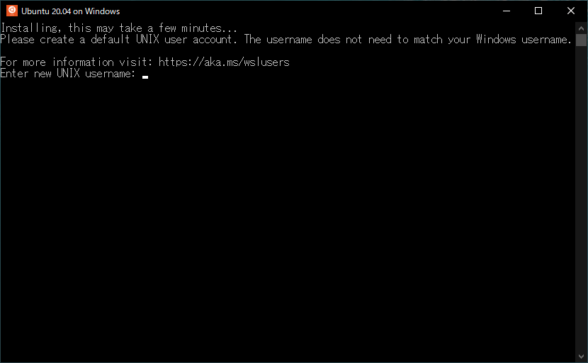

# WSL2のインストール

## 前提条件

* Windows 10 Pro 21H2

## インストール

!!! note
    10分～20分ほど時間がかかります

```powershell title="管理者権限のPowerShell"
wsl --install -d Ubuntu-20.04
```

```
インストール中: Linux 用 Windows サブシステム
Linux 用 Windows サブシステム はインストールされました。
ダウンロード中: WSL カーネル
インストール中: WSL カーネル
WSL カーネル はインストールされました。
ダウンロード中: Ubuntu 20.04 LTS
要求された操作は正常に終了しました。変更を有効にするには、システムを再起動する必要があります。
```

終わったら再起動します。

## 初期設定

再起動後、自動でプロンプトが表示されると思います。
手動で起動する場合はスタートメニューに登録されているUbuntu 20.04 on Windowsを選択します。



ユーザーを作成します。

```bash title="WSL2"
Enter new UNIX username: [ユーザー名を入力]
New password: [パスワードを入力]
Retype new password: [パスワードをもう一度入力]
```

念のため、WSLのバージョンを確認します。新しくコマンドプロンプトを起動して実行

```terminal title="コマンドプロンプト"
wsl -l -v
```

```
  NAME            STATE           VERSION
* Ubuntu-20.04    Running         2
```

VERSIONが1の場合はWSL1で起動なので、以下を参考にWSL2で起動するように設定してください。

https://docs.microsoft.com/ja-jp/windows/wsl/basic-commands

## 参考

https://docs.microsoft.com/ja-jp/windows/wsl/install

